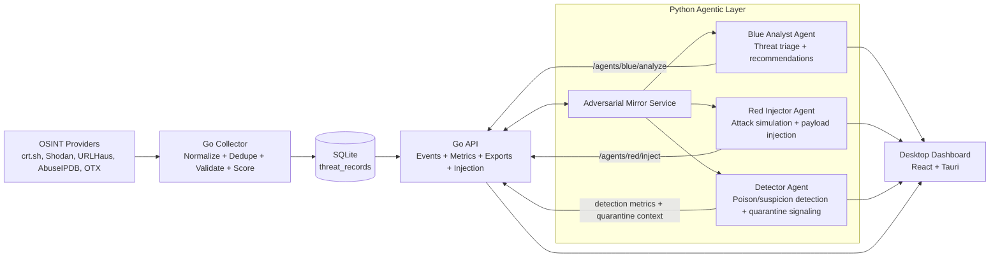

# SPECTER Project Report

Date: 2026-03-24
Project: SPECTER (Security Pipeline for Enriched Cyber Threat Event Response)
Challenge Context: Open Threat Intelligence Technical Challenge

## 1. Executive Summary

SPECTER is an end-to-end threat intelligence prototype designed to operationalize open-source intelligence (OSINT) into analyst-ready outputs. The platform implements a full data lifecycle:

1. Collect indicators from multiple public/intel providers.
2. Normalize and de-duplicate records.
3. Validate records with poisoning-aware detection rules.
4. Score risk and classify threat levels.
5. Expose events/metrics/exports via API.
6. Run red-vs-blue adversarial simulations to evaluate robustness.

The implementation combines a Go-based ingestion and API core, a Python FastAPI agent service for autonomous analysis and adversarial simulation, and a desktop-first React + Tauri dashboard.

## 2. Challenge Alignment

SPECTER addresses common technical challenge requirements for practical threat-intelligence systems:

- Multi-source ingestion: crt.sh, Shodan, URLHaus, AbuseIPDB, OTX.
- Structured processing pipeline: collect -> validate -> score -> export.
- Operational interfaces: health, events, metrics, and export endpoints.
- Analyst support: blue-agent analysis workflow and snapshot dashboard views.
- Adversarial resilience: synthetic poison-injection simulation with guardrails.
- Artifact generation: STIX export and report export for submission/review.

## 3. Solution Scope and Objectives

### 3.1 In-Scope Objectives

- Continuously ingest external indicators at configurable intervals.
- Persist normalized records with deterministic pipeline stages.
- Detect suspicious/poison-like patterns and quarantine when necessary.
- Compute a composite score and map to threat severity.
- Support SOC-style access patterns through JSON APIs.
- Provide demo-friendly orchestration, offline fallback, and bundle creation.

### 3.2 Out-of-Scope (Current Iteration)

- Full cloud-native deployment templates (Kubernetes/Terraform).
- Enterprise IAM/SSO and fine-grained RBAC.
- Distributed queue-based ingestion at very large scale.
- External SIEM-native connectors beyond current export endpoints.

## 4. System Architecture

### 4.1 Logical Architecture

### 4.2 Runtime Topology

- Collector service (Go): periodic provider polling and persistence.
- API service (Go): REST interface for operational data and exports.
- Worker service (Go): background processing of validated events.
- Agent service (Python/FastAPI): blue/red workflows and mirror analytics.
- Dashboard service (React/Tauri or Vite dev): analyst visualization layer.

## 5. Component Specifications

| Component | Language/Stack | Primary Responsibility | Key Interfaces |
|---|---|---|---|
| Collector | Go 1.24 | Pull provider data, normalize, dedupe, validate, score, persist | Provider Collect() calls, repository upsert |
| API Server | Go net/http | Expose health/events/metrics/exports/injection endpoints | /health, /api/v1/events, /api/v1/metrics/pipeline, /api/v1/exports/* |
| Worker | Go | Re-process validated records concurrently and persist scored outputs | ListByStage(validated), UpsertRecord |
| Storage | SQLite | Durable event storage and query support | threat_records table + indexes |
| Agent Service | Python 3.11 + FastAPI | Blue analysis, red injection, mirror ingestion/metrics/dashboard snapshots | /agents/*, /mirror/* |
| Desktop Dashboard | React 19 + Tauri 2 + Vite 8 | Local analyst UI and artifact workflow visibility | Reads Go + Agent APIs |

## 6. Data Pipeline Specification

### 6.1 Pipeline Stages

1. Ingested:
   - Raw indicator collected from configured providers.
2. Validated:
   - Detection rules applied (for poisoning/tampering signals).
3. Scored:
   - Composite score in range 0-100, threat level and days-to-attack mapped.
4. Quarantined:
   - Poison-detected or suspicious indicators redirected from standard path.

### 6.2 Scoring Logic (Current Implementation)

- Baseline score starts at 20.
- Corroboration contributes positive weighting.
- High-risk and secondary ports add weighted points.
- Synthetic indicators and poison/detection flags apply penalties.
- Final score is clamped to [0, 100].
- Threat levels:
  - critical: >= 80
  - high: >= 60
  - medium: >= 40
  - low: < 40

## 7. API Specifications

### 7.1 Go API Endpoints

| Method | Endpoint | Purpose | Notes |
|---|---|---|---|
| GET | /health | Liveness check | Returns status ok |
| GET | /api/v1/events | List all events or filter by stage | Supports stage and limit query params |
| GET | /api/v1/events/quarantined | List quarantined records | Quarantine monitoring |
| GET | /api/v1/metrics/pipeline | Pipeline counters and freshness telemetry | Includes per-source freshness ages |
| POST | /api/v1/exports/stix | Generate STIX artifact from scored records | Returns artifact path and count |
| POST | /api/v1/exports/report | Generate report artifact from all records | Returns artifact path and count |
| POST | /api/v1/agents/injections/trigger | Manual injection path | Normalizes, validates, scores, persists |

### 7.2 Agent Service Endpoints

| Method | Endpoint | Purpose |
|---|---|---|
| GET | /health | Agent service liveness |
| GET | /ready | Dependency-aware readiness |
| POST | /agents/blue/analyze | Blue analyst summary/recommendations |
| POST | /agents/red/inject | Red injector payload generation/submit |
| POST | /agents/run | Generic agent runner (blue_analyst or red_injector) |
| POST | /mirror/ingest | Ingest real IOC into adversarial mirror |
| GET | /mirror/events | Mirror event listing |
| GET | /mirror/injections | Mirror injection activity listing |
| GET | /mirror/metrics | Mirror balance and activity metrics |
| GET | /mirror/dashboard | Single snapshot for dashboard coherence |
| POST | /mirror/exports/stix | Snapshot-aligned STIX export |
| POST | /mirror/exports/report | Snapshot-aligned report export |

## 8. Data Model Specifications

### 8.1 Primary Persistence Schema

Table: threat_records

Core fields:

- Identity and IOC: event_id (PK), ioc_value, ioc_type.
- Source context: source_name, source_url, source_query, raw_evidence_json.
- Timing and quality: collected_at, created_at, updated_at, corroboration_count.
- Network context: open_ports_json, asn.
- Adversarial context: is_synthetic, poison_attack_type, poison_detected, detection_rule.
- Risk outcome: composite_score, threat_level, days_to_attack, pipeline_stage.

Indexes:

- idx_threat_records_stage on pipeline_stage.
- idx_threat_records_ioc on (ioc_type, ioc_value).
- idx_threat_records_collected_at on collected_at.

## 9. Runtime and Environment Specifications

### 9.1 Prerequisites

- Go 1.24+
- Python 3.11+
- Node.js 18+
- Rust toolchain (for Tauri desktop builds)
- Bash shell

### 9.2 Default Local Ports

- Go API: 8080
- Agent API: 8001
- Dashboard dev: 5173

### 9.3 Key Configuration Variables

- Pipeline: COLLECTION_INTERVAL_SECONDS, WORKER_CONCURRENCY, DB_DSN.
- Providers: SHODAN_TARGETS, ABUSEIPDB_TARGETS, OTX_TARGETS, URLHAUS_HOSTS, CRTSH_QUERY.
- Provider toggles: ENABLE_SHODAN, ENABLE_ABUSEIPDB, ENABLE_OTX, ENABLE_URLHAUS, ENABLE_CRTSH.
- CORS: API_ALLOWED_ORIGINS, AGENT_ALLOWED_ORIGINS.
- Adversarial controls: RED_AGENT_INTERVAL_SECONDS, RED_MAX_RATIO, MIN_REAL_EVENTS_BEFORE_AUTO_RED.
- Sync controls: GO_SYNC_INTERVAL_SECONDS, GO_SYNC_BATCH_LIMIT, GO_SYNC_ON_STARTUP.

## 10. Reliability, Security, and Operational Controls

### 10.1 Reliability Controls

- Provider-aware error classification and cooldown strategy.
- Backoff/suppression behavior for transient and rate-limited sources.
- Graceful shutdown handling for worker service.
- Health and readiness endpoints for active monitoring.

### 10.2 Security/Integrity Controls

- CORS allowlist enforcement at API boundaries.
- Poisoning-aware validation and quarantining stage.
- Red/blue balancing controls to prevent synthetic over-dominance.
- Deterministic export paths for evidence retention.

### 10.3 Offline and Demo Resilience

- Offline snapshot loader for degraded connectivity scenarios.
- Automated artifact-bundle script for submission packaging.
- End-to-end run orchestration script with PID/log management.

## 11. Verification and Quality Assurance Specifications

### 11.1 Test Strategy

- Go unit/integration tests across internal services and API layers.
- Python tests for agent behavior, mirror exports, and contract checks.
- Contract-marked tests run against temporary Go API fixture.
- Syntax/compile checks for Python modules and shell scripts.

### 11.2 CI-Equivalent Local Gate

`scripts/ci_check.sh` validates:

1. Go test suite.
2. Python test suite.
3. Contract-only tests.
4. Python compile checks.
5. Shell script syntax checks.

## 12. Known Limitations and Technical Risks

- SQLite is appropriate for prototype/single-node workflow, but not horizontal scale.
- Upstream provider rate limits and account capabilities can reduce ingest throughput.
- Current deployment model is local-first; cloud hardening and secret governance remain future work.
- Report polish and interoperability validation tasks are still tracked as active TODOs.

## 13. Roadmap (Recommended Next Iteration)

1. Add fault-injection and resilience tests for provider timeouts/429/malformed payloads.
2. Expand full-path end-to-end deterministic test coverage.
3. Validate STIX artifacts with external validators/importers (for interoperability proof).
4. Add hosted CI workflow parity with local ci-check profile.
5. Complete final submission assets (screenshots, short demo video, checklist).

## 14. Conclusion

SPECTER demonstrates a complete threat-intelligence engineering pipeline with practical operational controls: multi-source ingestion, poisoning-aware validation, deterministic scoring, analyst-facing APIs, adversarial simulation, and exportable artifacts. The architecture is modular and implementation-ready for challenge evaluation, while still preserving clear pathways for scale, hardening, and interoperability enhancements.